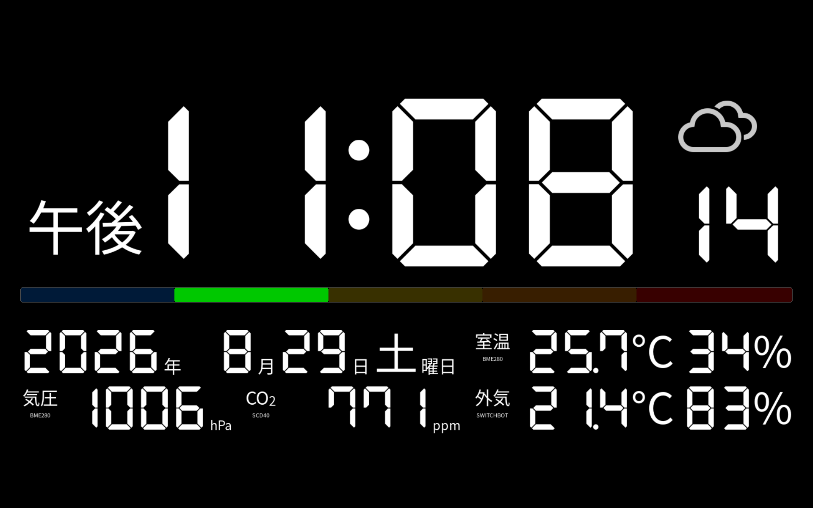
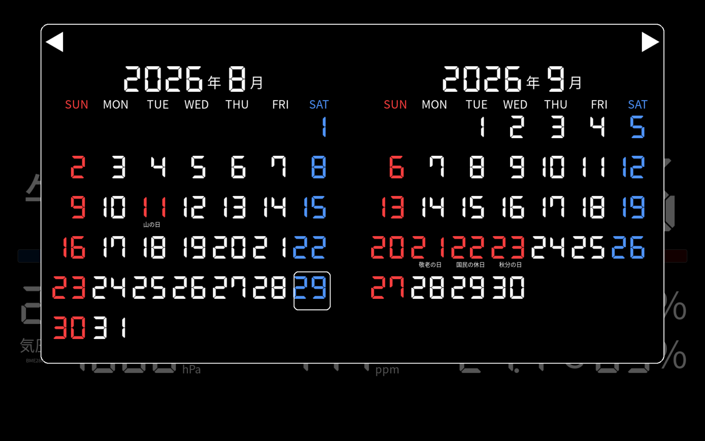
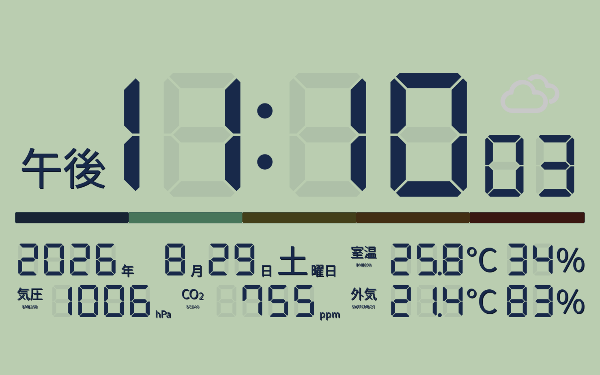

# DeskSide Clock

Raspberry Pi 5とHDMIタッチディスプレイを使った、常時表示型のデスクサイドクロックです。時刻・カレンダー・天気・室内外の温湿度・気圧・CO₂・空気質を表示し、人感・照度・顔認識を利用して画面や照明を制御します。

### デフォルトテーマ



### カレンダー表示



### LCDテーマ



## 現在のバージョン

- 製品名: Desk Side Clock
- バージョン: **v2.3.6**
- ステータス: release
- GitHubデフォルトブランチ: `main`
- Copyright 2026 Hiroshi Ishikawa. Powered by momopoem inc.

詳細資料は次のファイルにあります。

- `documents/DeskSideClock_基本設計書_v2.3.6.docx`
- `documents/DeskSideClock_ソフトウェア仕様書_v2.3.6.docx`

## 主な機能

- 時刻、日付、カレンダー、祝日の表示
- Open-MeteoまたはSwitchBotから取得した屋外気象情報の表示
- ローカルI²Cセンサーによる温湿度、気圧、CO₂、TVOC、eCO₂、空気質の表示
- タッチ操作による表示情報の切り替え
- PIR人感センサーと照度センサーによる自動減光・画面消灯・復帰
- 顔認識とSwitchBot Cloud APIを組み合わせた照明制御
- 人感検知中の`turnOn`再送とBH1750による実点灯確認・不達再試行
- NTP同期状態の監視
- 状態選択の永続化

## ハードウェア構成

| 機器 | 用途・接続 |
|---|---|
| Raspberry Pi 5 Model B Rev 1.1 | メインコンピューター |
| YMK EM101 HDMIディスプレイ | 1920×1200、約10.1インチ、HDMI-A-1 |
| BME280（I²C `0x76`） | 室温・湿度・気圧。温度補正値は`-5.1℃` |
| SCD40（I²C `0x62`） | CO₂・温度・湿度 |
| ENS160（I²C `0x53`） | AQI・TVOC・eCO₂。温湿度補正にはBME280値を使用 |
| SHT20（I²C `0x40`） | 室温・湿度。温度補正値は`-4.2℃` |
| AHT21（I²C `0x38`） | 温度・湿度センサー。raw I²C転送で通信 |
| BH1750（I²C `0x23`） | 周囲照度 |
| HC-SR501 PIRセンサー | 人感検出、GPIO 17 |
| カメラ | OpenCVによる顔検出・顔認識 |
| SwitchBot対応照明・温湿度計 | Cloud API経由の照明制御・室内外データ取得 |

I²C機器は原則としてバス1を共有し、アプリケーション内のロックでアクセスを直列化しています。実際の配線、I²Cアドレス、GPIO番号は導入環境に合わせて確認してください。

## ソフトウェア構成

現在の実機環境は次のとおりです。

- OS: Debian GNU/Linux 13（Trixie）
- カーネル: `6.18.39+rpt-rpi-2712`
- Python仮想環境: `./venv`
- 画面: Wayland + pygame（SDL Waylandバックエンド）
- 起動管理: user systemdの`deskclock.service`
- ログ: `./log/clock.log`
- 永続状態: `~/.config/deskclock/state.json`

主要なPython依存関係は以下です。

| パッケージ | 主な用途 |
|---|---|
| pygame | UI描画、タッチ入力 |
| requests | Open-Meteo・SwitchBot API通信 |
| numpy | 数値処理 |
| opencv-contrib-python | 顔検出・LBPH顔認識 |
| holidays / jpholiday | 祝日判定 |
| smbus2 | I²C通信 |

Raspberry Pi側では、用途に応じて`gpiod`、`i2c-tools`、日本語フォント、Wayland環境などのシステムパッケージも必要です。

## ディレクトリ構成

```text
app/                 メインアプリケーション
  services/          センサー、天気、NTP、照明、輝度制御
  renderer/          画面描画
  widgets/           時計・情報表示ウィジェット
  test/              実機向けセンサー診断スクリプト
face/                顔登録・認識コード（個人データはリポジトリ外）
fonts/               同梱フォント
tests/               自動テスト
documents/           設計・仕様資料
run-clock.sh         systemdから呼び出す起動スクリプト
```

## 設定

主要設定は`app/config.py`にあります。I²Cバス・一部アドレスは環境変数で上書きできます。SwitchBot連携では、少なくとも次の機密値を`switchbot.env`などからサービスへ渡します。

```text
SWITCHBOT_TOKEN
SWITCHBOT_SECRET
SWITCHBOT_inDeviceId
SWITCHBOT_outDeviceId
SWITCHBOT_lightDeviceId
OPEN_METEO_LATITUDE
OPEN_METEO_LONGITUDE
OPEN_METEO_TIMEZONE
DESKCLOCK_FACE_LABEL
```

認証情報をソース、ログ、Issue、スクリーンショットへ記載しないでください。`.gitignore`は`.env`、`switchbot.env`、`secrets/`、`credentials/`を除外します。

顔画像、学習済みモデル、認識時のデバッグ画像は個人データです。Git管理せず、既定で`~/.local/share/deskclock/face`に保存します。保存先は`DESKCLOCK_FACE_DATA_DIR`、登録対象のローカルラベルは`DESKCLOCK_FACE_LABEL`環境変数で変更できます。このディレクトリのアクセス権とバックアップは運用者が管理してください。

### Open-Meteo

> Weather data by Open-Meteo.com (CC BY 4.0)

既定の`api.open-meteo.com`無料APIは、Open-Meteoの現行条件上、非商用利用向けで呼び出し上限があります。本アプリの既定間隔は上限を大幅に下回りますが、商用環境では適切な有料またはセルフホストのエンドポイントを用意し、`OPEN_METEO_BASE_URL`で指定してください。取得データはCC BY 4.0の対象です。画面上では対象データの情報源を`OPEN-METEO.COM`と表示します。

設置地点は`OPEN_METEO_LATITUDE`、`OPEN_METEO_LONGITUDE`、`OPEN_METEO_TIMEZONE`で設定してください。公開ソースの既定値は特定の個人宅や設置場所を示さない汎用値です。正確な設置場所をGitへコミットしないでください。

### SwitchBot Cloud API

SwitchBot Open APIは公式文書上、個人利用向けです。商用利用または大規模利用では、事前にSwitchBotへ相談し、許諾・利用上限・契約条件を確認してください。トークン、シークレット、デバイスIDは非Git管理の環境ファイルから渡してください。

## 起動とテスト

実機ではuser systemdサービスとして起動します。

```bash
systemctl --user enable --now deskclock.service
systemctl --user status deskclock.service
journalctl --user -u deskclock.service
```

依存関係がそろった開発環境では、次のコマンドでテストできます。

```bash
python -m unittest discover -s tests -v
python -m compileall -q app tests
```

センサー診断スクリプトを実行する際は、DeskSide Clock本体と同じI²Cバスへ同時アクセスしないよう、必要に応じてサービスを停止してください。

### 照明再送・点灯確認の実機テスト

1. プロジェクトディレクトリで部屋を暗くし、`tail -f ./log/clock.log | grep --line-buffered '\[LGT\]'`を開きます。
2. PIRの前で動き、`api_command=turnOn`の初回送信と、3秒後の`verification=repeat-turnOn`を確認します。
3. 照明が点くと`verification=confirmed`と実測luxが記録されます。
4. 不達を再現するには、SwitchBot Hubの赤外線送信部を一時的に遮ります。最大3回の`turnOn`後も暗い場合、`[LGT] 点灯確認失敗`が記録されます。

赤外線を遮るテストではHubの電源を切らず、放熱口を塞がないでください。ログ上の`result=OK`はAPI受付成功、`verification=confirmed`はBH1750による実点灯確認を意味します。

## 著作権・ライセンス

### 本プロジェクトのコードと資料

本プロジェクトのオリジナルソフトウェアはMIT Licenseで提供します。条件と免責は`LICENSE`を参照してください。同梱する第三者フォント、取得データ、依存パッケージにはそれぞれのライセンスが適用されます。詳細は`THIRD_PARTY_NOTICES.md`を参照してください。

### 同梱フォント

- `fonts/DSEG7Classic-Bold.ttf`: SIL Open Font License 1.1。`fonts/DSEG-LICENSE.txt`を同梱します。
- `fonts/weathericons/weathericons-regular-webfont.ttf`: SIL Open Font License 1.1。`fonts/weathericons/LICENSE.txt`を同梱します。
- OSから読み込むNoto Sans CJK、DejaVu Sansなどはリポジトリに同梱せず、OS側の各ライセンスが適用されます。

### 外部ライブラリとサービス

- PythonパッケージおよびOSパッケージには、それぞれ固有のライセンスが適用されます。`requirements.txt`は依存関係の一覧であり、ライセンス許諾文ではありません。製品配布時は、実際に組み込む版のライセンスとNOTICE要件を確認してください。
- Open-Meteoの帰属、データライセンス、無料APIの非商用条件は上記の「Open-Meteo」および`THIRD_PARTY_NOTICES.md`を参照してください。
- SwitchBot Cloud APIは同サービスの利用規約、API制限、商標条件に従います。本プロジェクトはSwitchBotの公式製品ではありません。

### 個人情報・認証情報

顔画像、学習済みLBPHモデル、デバッグ画像はリポジトリに含めません。生体情報・個人情報として、リポジトリ外でアクセス制御してください。証明書、秘密鍵、APIトークンもGitにコミットしないでください。

## 免責

本システムは開発中の個人向け設備です。センサー値、天気、空気質、CO₂値は参考情報であり、安全管理、健康判断、防災、医療その他の重要判断には使用しないでください。GPIO、I²C、電源、HDMI制御、外部照明制御は、誤配線や誤動作により機器を損傷する可能性があります。利用者の責任でバックアップと復旧手段を確保してください。
