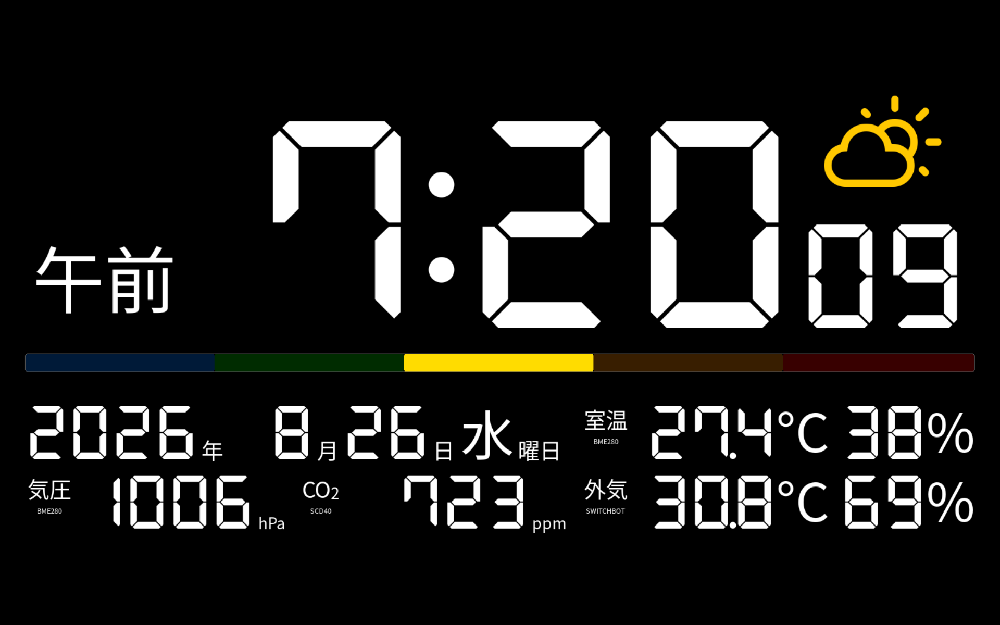

# DeskSide Clock

Raspberry Pi 5とHDMIタッチディスプレイを使った、常時表示型のデスクサイドクロックです。時刻・カレンダー・天気・室内外の温湿度・気圧・CO₂・空気質を表示し、人感・照度・顔認識を利用して画面や照明を制御します。



## 現在のバージョン

- 製品名: Desk Side Clock
- バージョン: **v2.3.1**
- ステータス: release
- GitHubデフォルトブランチ: `main`
- Copyright 2026 Hiroshi Ishikawa. Powered by momopoem inc.

詳細資料は次のファイルにあります。

- `documents/DeskSideClock_基本設計書_v2.3.0.docx`
- `documents/DeskSideClock_ソフトウェア仕様書_v2.3.0.docx`

## 主な機能

- 時刻、日付、カレンダー、祝日の表示
- Open-MeteoまたはSwitchBotから取得した屋外気象情報の表示
- ローカルI²Cセンサーによる温湿度、気圧、CO₂、TVOC、eCO₂、空気質の表示
- タッチ操作による表示情報の切り替え
- PIR人感センサーと照度センサーによる自動減光・画面消灯・復帰
- 顔認識とSwitchBot Cloud APIを組み合わせた照明制御
- NTP同期状態の監視
- 状態選択の永続化

## ハードウェア構成

現在の実機`momoRB5`を基準にしています。

| 機器 | 用途・接続 |
|---|---|
| Raspberry Pi 5 Model B Rev 1.1 | メインコンピューター |
| YMK EM101 HDMIディスプレイ | 1920×1200、約10.1インチ、HDMI-A-1 |
| BME280（I²C `0x76`） | 室温・湿度・気圧。温度補正値は`-5.1℃` |
| SCD40（I²C `0x62`） | CO₂・温度・湿度 |
| ENS160（I²C `0x53`） | AQI・TVOC・eCO₂。温湿度補正にはBME280値を使用 |
| SHT20（I²C `0x40`） | 室温・湿度。温度補正値は`-4.2℃` |
| AHT21（I²C `0x38`） | 温度・湿度センサー。raw I²C転送で通信 |
| BH1750（I²C `0x23`） | 周囲照度 |
| HC-SR501 PIRセンサー | 人感検出、GPIO 17 |
| カメラ | OpenCVによる顔検出・顔認識 |
| SwitchBot対応照明・温湿度計 | Cloud API経由の照明制御・室内外データ取得 |
| Android TV対応機器 | `androidtvremote2`による電源・キー操作補助 |

I²C機器は原則としてバス1を共有し、アプリケーション内のロックでアクセスを直列化しています。実際の配線、I²Cアドレス、GPIO番号は導入環境に合わせて確認してください。

## ソフトウェア構成

現在の実機環境は次のとおりです。

- OS: Debian GNU/Linux 13（Trixie）
- カーネル: `6.18.39+rpt-rpi-2712`
- Python仮想環境: `PROJECT_DIR/venv`
- 画面: Wayland + pygame（SDL Waylandバックエンド）
- 起動管理: user systemdの`deskclock.service`
- ログ: `PROJECT_DIR/log/clock.log`
- 永続状態: `~/.config/deskclock/state.json`

主要なPython依存関係は以下です。

| パッケージ | 主な用途 |
|---|---|
| pygame | UI描画、タッチ入力 |
| requests | Open-Meteo・SwitchBot API通信 |
| numpy | 数値処理 |
| opencv-contrib-python | 顔検出・LBPH顔認識 |
| holidays / jpholiday | 祝日判定 |
| smbus2 | I²C通信 |
| androidtvremote2 | Android TVリモート操作 |

Raspberry Pi側では、用途に応じて`gpiod`、`i2c-tools`、日本語フォント、Wayland環境などのシステムパッケージも必要です。

## ディレクトリ構成

```text
app/                 メインアプリケーション
  services/          センサー、天気、NTP、照明、輝度制御
  renderer/          画面描画
  widgets/           時計・情報表示ウィジェット
  test/              実機向けセンサー診断スクリプト
face/                顔登録・認識、画像、学習モデル
fonts/               同梱フォント
tests/               自動テスト
tv_cert/             Android TV接続補助とクライアント証明書
documents/           設計・仕様資料
run-clock.sh         systemdから呼び出す起動スクリプト
```

## 設定

主要設定は`app/config.py`にあります。I²Cバス・一部アドレスは環境変数で上書きできます。SwitchBot連携では、少なくとも次の機密値を`switchbot.env`などからサービスへ渡します。

```text
SWITCHBOT_TOKEN
SWITCHBOT_SECRET
SWITCHBOT_inDeviceId
SWITCHBOT_outDeviceId
SWITCHBOT_lightDeviceId
```

認証情報をソース、ログ、Issue、スクリーンショットへ記載しないでください。`.gitignore`は`.env`、`switchbot.env`、`secrets/`、`credentials/`を除外します。

## 起動とテスト

実機ではuser systemdサービスとして起動します。

```bash
systemctl --user enable --now deskclock.service
systemctl --user status deskclock.service
journalctl --user -u deskclock.service
```

依存関係がそろった開発環境では、次のコマンドでテストできます。

```bash
python -m unittest discover -s tests -v
python -m compileall -q app tests
```

センサー診断スクリプトを実行する際は、DeskSide Clock本体と同じI²Cバスへ同時アクセスしないよう、必要に応じてサービスを停止してください。

## 著作権・ライセンス・利用上の制限

### 本プロジェクトのコードと資料

現時点で、このリポジトリにはプロジェクト全体へ適用する`LICENSE`ファイルがありません。各ソースには`Copyright 2026 (C) Hiroshi Ishikawa. powered by momopoem inc.`との表示がありますが、これは第三者に複製、改変、再配布、商用利用を許諾するものではありません。

したがって、明示的な許可を得ていない第三者は、本プロジェクトのコード、設計資料、画像、学習済みモデルを公開・再配布・商用利用しないでください。将来LICENSEファイルが追加された場合は、その内容を優先してください。

### 同梱フォント

- `fonts/DSEG7Classic-Bold.ttf`: DSEG Font Family。SIL Open Font License 1.1。Copyright keshikan、Reserved Font Name「DSEG」。フォントを取り出せる形式で再配布する場合は、著作権表示またはOFLライセンス文の同梱が必要です。改変フォントを配布する場合もOFL 1.1を維持し、Reserved Font Nameの条件を守ってください。
- `fonts/weathericons/weathericons-regular-webfont.ttf`: Weather Icons。フォントはSIL Open Font License 1.1。元のアイコンデザインはLukas Bischoff、フォント等はErik Flowersによります。
- OSから読み込むNoto Sans CJK、DejaVu Sansなどには、それぞれの配布元ライセンスが適用されます。

このリポジトリにはフォントのライセンス全文が同梱されていません。リポジトリを第三者へ配布する前に、各ライセンス原文と著作権表示を追加してください。

### 外部ライブラリとサービス

- PythonパッケージおよびOSパッケージには、それぞれ固有のライセンスが適用されます。`requirements.txt`は依存関係の一覧であり、ライセンス許諾文ではありません。製品配布時は、実際に組み込む版のライセンスとNOTICE要件を確認してください。
- Open-Meteo APIから得られるデータはCC BY 4.0に基づき、利用時にはOpen-Meteoおよびデータ提供者への適切な帰属表示が必要です。商用・高頻度利用については、利用時点のOpen-Meteo利用条件も確認してください。
- SwitchBot Cloud APIおよびAndroid TV連携は各サービス・製品の利用規約、API制限、商標条件に従います。本プロジェクトは各サービス提供者による公式製品ではありません。

### 個人情報・認証情報

`face/`には個人を識別し得る顔画像と学習済みLBPHモデルが含まれます。これらは生体情報・個人情報として扱い、本人の同意なく複製、公開、第三者提供しないでください。

`tv_cert/client.pem`と`tv_cert/client.key`は接続用の証明書・秘密鍵です。秘密鍵を含むリポジトリの公開や第三者配布は禁止し、漏えいの可能性がある場合は対象機器とのペアリングを解除して鍵を再発行してください。公開リポジトリへ移行する場合は、履歴を含めて認証情報と個人画像を除去する必要があります。

## 免責

本システムは開発中の個人向け設備です。センサー値、天気、空気質、CO₂値は参考情報であり、安全管理、健康判断、防災、医療その他の重要判断には使用しないでください。GPIO、I²C、電源、HDMI制御、外部照明制御は、誤配線や誤動作により機器を損傷する可能性があります。利用者の責任でバックアップと復旧手段を確保してください。
